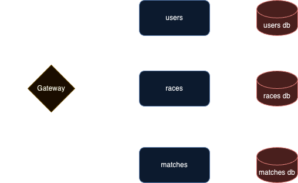

# TSTOPS-M1

Mobile Applications and the BFF Architecture using GraphQL​

## Server

### Diagram




### Schema

#### Users

```graphql
extend schema @link(url: "https://specs.apollo.dev/federation/v2.0", import: ["@key", "@shareable"])

type Query {
    users(first: Int = 10, after: ID): [User!]!
}

type Mutation {
  login(email: String!, password: String!): String
  register(command: RegisterInput!): User!
}

input RegisterInput {
  name: String!
  email: String!
  password: String!
  roles: [String!]!
}

type User @key(fields: "id") {
    id: ID!
    name: String!
    email: String!
    roles: [String!]!
}
```

#### Races

```graphql
extend schema @link(url: "https://specs.apollo.dev/federation/v2.0", import: ["@key", "@shareable"])

type Query {
    races(first: Int = 10, after: ID): [Race!]!
    horses(first: Int = 10, after: ID): [Horse!]!
}

type Mutation {
  addRace(command: AddRaceInput!): Race!
  addHorse(command: AddHorseInput!): Horse!
  enrollHorse(command: EnrollHorseInput!): Horse!
}

input AddRaceInput {
  no: Int
  startTime: String!
  venue: String
}

input AddHorseInput {
  name: String!
  rank: Int
}

input EnrollHorseInput {
  race: ID!
  horse: ID!
}

type Race @key(fields: "id") {
    id: ID!
    no: Int
    startTime: String!
    venue: String!
    horses: [Horse]!
}

type Horse @key(fields: "id") {
    id: ID!
    name: String!
    rank: Int
    race: Race
}
```

#### Matches

```graphql
extend schema @link(url: "https://specs.apollo.dev/federation/v2.0", import: ["@key", "@shareable"])

type Query {
    matches(first: Int = 10, after: ID): [FootballMatch]!
    teams(first: Int = 10, after: ID): [Team]!
    players(first: Int = 10, after: ID): [Player]!
}

type Mutation {
    addTeam(command: AddTeamInput!): Team
    addPlayer(command: AddPlayerInput!): Player
    joinTeam(command: JoinTeamInput!): Player
    addMatch(command: AddMatchInput!): FootballMatch
}

input AddTeamInput {
    name: String!
    country: String!
}

input AddPlayerInput {
    name: String!
    age: Int
    team: ID
}

input JoinTeamInput {
    player: ID!
    team: ID!
}

input AddMatchInput {
    no: Int
    startTime: String!
    venue: String!
    country: String!
    homeTeam: ID!
    visitorsTeam: ID!
}

type FootballMatch @key(fields: "id") {
    id: ID!
    no: Int
    startTime: String!
    venue: String!
    country: String!
    homeTeam: Team!
    visitorsTeam: Team!
}

type Team @key(fields: "id") {
    id: ID!
    name: String!
    country: String!
    players: [Player!]!
}

type Player @key(fields: "id") {
    id: ID!
    name: String!
    age: Int
    team: Team
}
```

### Auth

Login mutation:

```graphql
mutation Login($email: String!, $password: String!) {
  login(email: $email, password: $password)
}
```

with variables

```json
{
  "email": "johndoe@email.com",
  "password": "pAsSWoRd!"
}
```


Register mutation:

```graphql
mutation Register($command: RegisterInput!) {
  register(command: $command) {
    id
    name
    email
    roles
  }
}
```

with variables

```json
{
  "command": {
    "email": "your@email.com",
    "name": "name",
    "password": "password",
    "roles": ["role"]
  }
}
```

Auth token is expected in `x-access-token` header for all operations except `login`


### How To

From the root folder of the repository

To run the server:

```bash
make server-up
```

To rebuild the server containers:

```bash
make server-build
```

To tear-down the containers:

```bash
make server-down
```

Build iOS client

```bash
make client-build-ios
```

Run iOS client

```bash
make client-ios
```

Run both server federated graph and iOS client

```bash
make run-ios
```
